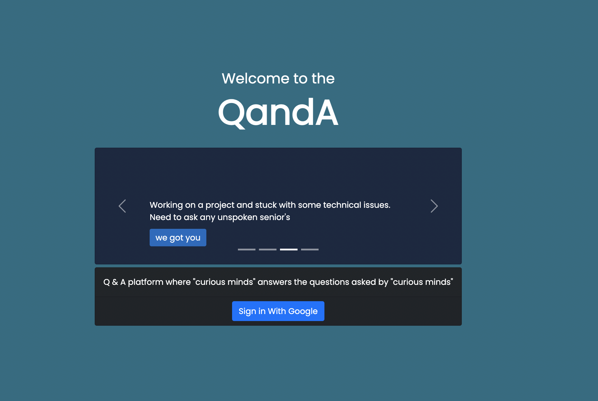
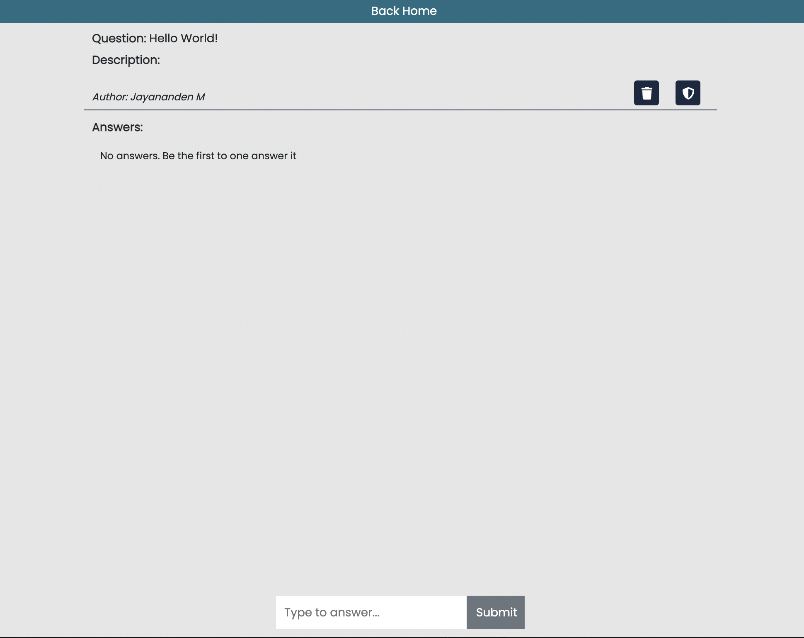
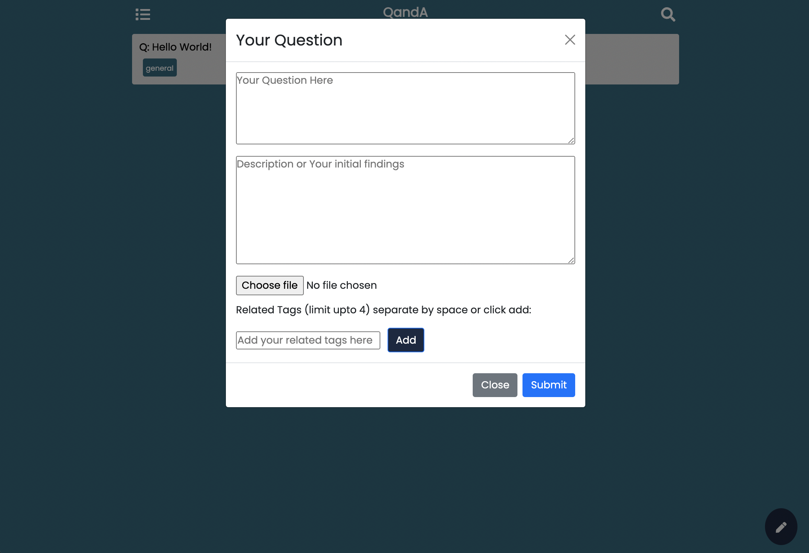
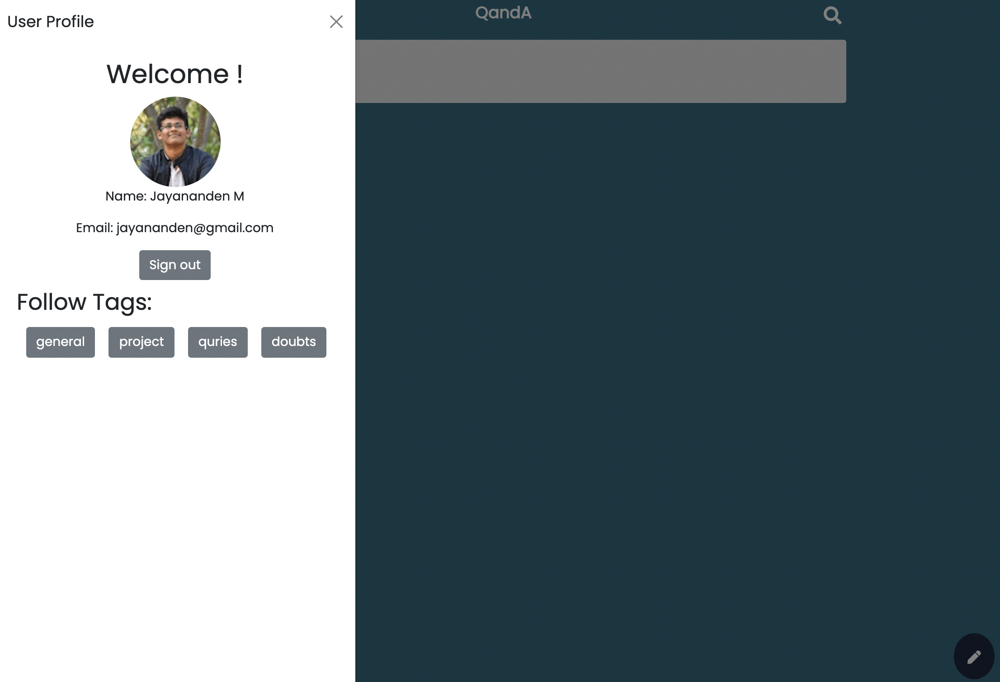
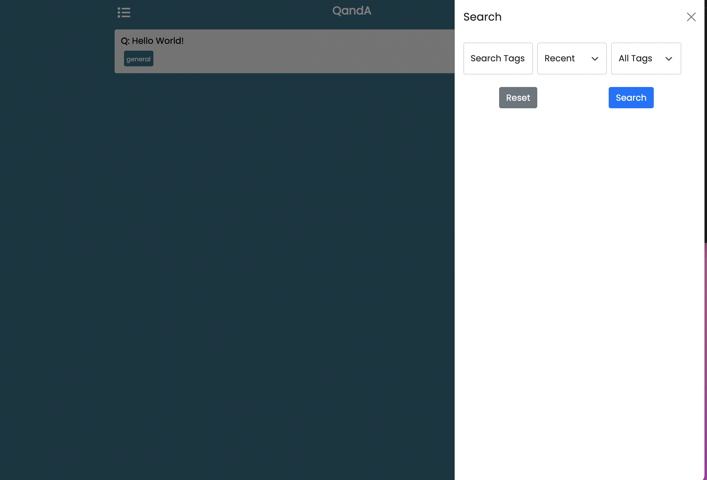

# Q and A 

Online Q & A platform supported with tags system built with React JS and Firebase as backend for user authentication, realtime database for querying the posts.

## Tech Stack

    Frontend - HTML, CSS, React JS
    Backend  - Firebase(Authentication, Realtime Database, Storage)
    Hosting  - Firebase(Hosting)

Website Link: https://qanda-d5638.web.app/

*Since the website requires you to login using google account but if you don't want to create an account, you can see the glimpse of how the website looks and works from the below images.*

## Login Page 

## Home Page

## Question Page

## Add Question

## User Profile

## Search Tag

Website Link: https://qanda-d5638.web.app/

